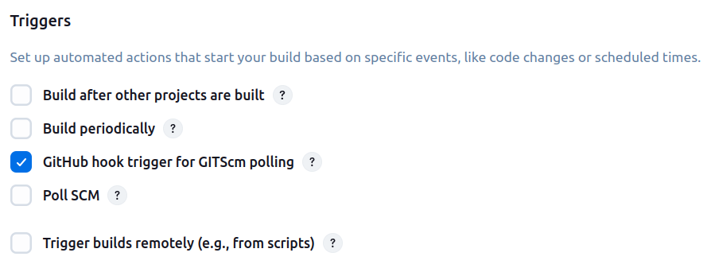
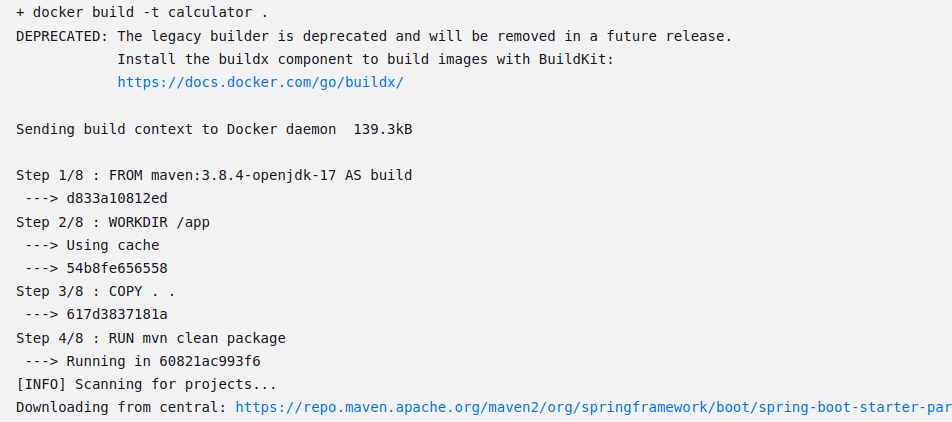

# Report: Scientific Calculator with DevOps
*Name : M B Ashish | Roll Number : MT2024085*

### Links

#### GitHub: https://github.com/mbashish007/Calculator

#### DockerHub: https://hub.docker.com/u/mbashish

## DevOps Brief

DevOps provides world-class quality, reliability,
stability, and security at ever lower cost and effort; accelerated flow and reliability throughout the technology value stream, including Product
Management, Development, QA, IT Operations, and Infosec.

### Guiding Principles of DevOps

#### Lean
Lean principly focus on how to create value for the customer through systems
thinking by creating constancy of purpose, embracing scientific thinking,
creating flow and pull (versus push), assuring quality at the source, leading with
humility, and respecting every individual.

#### Agile
Key Principle deliver working software frequently with shorter timescales.

#### Continous Delivery
Emphasises the importance of *Deployment Pipeline* for keeping code and infrastructure always in deployement mode, i.e. Continous build, test, integration.

### Tools

<table>
  <thead>
    <tr>
      <th>DevOps Practice</th>
      <th>Primary Tool(s)</th>
      <th>Explanation</th>
    </tr>
  </thead>
  <tbody>
    <tr>
      <td><strong>Source Control Management (SCM)</strong></td>
      <td>Git, GitHub</td>
      <td>Manages version control for code repositories.</td>
    </tr>
    <tr>
      <td><strong>Continuous Integration (CI)</strong></td>
      <td>Jenkins</td>
      <td>Automates build, test, and integration of code.</td>
    </tr>
    <tr>
      <td><strong>Continuous Delivery (CD)</strong></td>
      <td>Jenkins, Ansible</td>
      <td>Automates deployment of applications (e.g., pulling Docker images, running containers).</td>
    </tr>
    <tr>
      <td><strong>Containerization</strong></td>
      <td>Docker</td>
      <td>Packages applications into lightweight containers.</td>
    </tr>
    <tr>
      <td><strong>Configuration Management</strong></td>
      <td>Ansible </td>
      <td>Manages infrastructure as code and automates setup.</td>
    </tr>
  </tbody>
</table>

### Setup

#### Source Control Management

Source Control Management (SCM) is a system that helps developers track, manage, and coordinate changes to source code over time. It allows multiple contributors to work on a project simultaneously while keeping a history of all modifications.

##### Git
Git is a distributed version control system, to manage source code versions in local machine.

##### GitHub
GitHub is a file hosting service, which uses git to create, store, manage the remote repositories.

##### Git Project Initialization
- Install Git
    - sudo apt update
    - sudo apt install git -y
- Configure Git
    - git config --global user.name "M B Ashish"
    - git config --global user.email "some@gmail.com"

- Create Repository
    - 

- Clone Git Repository to Local
    - git clone https://github.com/mbashish007/Calculator.git

 
 

##### Creating Spring Project
- create spring project using [spring intializer](https://start.spring.io/).
-  

#### Continous Integeration/Delivery

##### Jenkins

- Instalation
    - sudo apt update
    - sudo apt upgrade –y
    - Install Java
        - sudo apt install -y openjdk-17-jdk
        - java –version
        - 
        - sudo wget -O /usr/share/keyrings/jenkins-keyring.asc \
          https://pkg.jenkins.io/debian-stable/jenkins.io-2023.key
        - echo "deb [signed-by=/usr/share/keyrings/jenkins-keyring.asc]" \
          https://pkg.jenkins.io/debian binary/ | sudo tee \
          /etc/apt/sources.list.d/jenkins.list > /dev/null
        - sudo apt-get update
        - sudo apt-get install jenkins
- Start and Enable Jenkins
    - *Start Jenkins*  : sudo systemctl start Jenkins
    - *Enable Jenkins to Start on Boot* : sudo systemctl enable Jenkins
    - sudo systemctl status Jenkins

- Access Jenkins
    - localhost:8080
- Install NGROK
    - snap install ngrok
- Configure NGROK
    - ngrok config add-authtoken < your auth token >
- Run NGROK
    - ngrok http --url=alert-eagerly-snail.ngrok-free.app 8080
- Change Jenkins URL to NGROK
    - 
    - 
    - restart jenkins
- Install Jenkins Plugins
    - Docker Pipeline
    - Docker Commons Plugin
    - Ansible Plugin

 
 

- Create Jenkins Pipeline
    - create jenkins pipeline file : jenkinsfile
    - add to your github repo, root directory
    - 
    - 
    - Navigate to Jenkins -> Dashboard->New Item
    - 
    - configure pipeline
    - 
    - 

#### Containerization

##### Virtualization
Virtualization is a technology, to create multiple simulated environments from a single, physical hardware systems.

##### Containerization
Containerization is a modern virtualization method as a form of operating system virtualization.

Containerization uses a single OS kernel to power multiple distributed applications without the need for an hypervisor.

A container is a standard unit of software that packages up code and all its dependencies so the application runs quickly and reliably from anywhere.
##### Docker
Docker is an open source tool that helps in the management of containers.

Use Cases: Application development, testing, packaging and deployment. PaaS, SaaS and Cloud Infrastructure. Application and service isolation.

A Docker container image is a lightweight, standalone, executable package of software that includes everything needed to run an application: code, runtime, system tools, system libraries and settings.

Container images become containers at runtime.

##### Create Docker File
- Create Docker File: Dockerfile
- Push to GitHub repository, in root directory
- 

#### Configuration Management

Configuration management is a systems engineering process that helps businesses maintain the performance quality and functionality of a given product, system or other IT asset throughout its lifecycle.

Infrastructure as Code (IaC) refers to the practice of managing and provisioning infrastructure through code and automation rather than manual processes.

In the context of IaC, configuration management plays a pivotal role in automating and standardizing the deployment and management of infrastructure resources.

##### Ansible

Ansible is an open-source IT automation tool that simplifies tasks such as configuration management, application deployment, and cloud provisioning.

It operates without the need for agents on remote systems, utilizing SSH for communication.

Ansible uses YAML-based playbooks to define automation processes, making it accessible and efficient for managing complex IT environments
and it uses inventory file to defines hosts and groups of hosts upon which commands, modules, and tasks in a playbook operate.

##### Define Hosts
- Create a Ansible Inventory file named : inventory
- Push to GitHub repository, in root directory
- 

##### Define Playbook
- Create a Ansible Playbook script named : deploy.yml
- Push to GitHub repository, in root directory
- 

#### Miscellaneous

#### Adding Webhook Action to GitHub Repository
- Navigate to github.com -> profile -> setting -> developer setting
- 
- Create Personal Access Token -> Tokens (Classic)
- 
- Give the following permissions
- 
- 
- Navigate to the setting of the profile
- 
- Create Webhook, in secret add the token created in the above step.
- 

### Output

##### Jenkins Pipeline
- 

##### Git CheckOut after WebHook
- 

##### Build, Test, Package Spring Application
- 
- 
- 
- 

##### Push Docker Image to DockerHub
- 
##### Deploying Application to Managed Host using Ansible
- 
- 

##### Post Deployment Mail
- 
##### Accessing Application

- 
- 